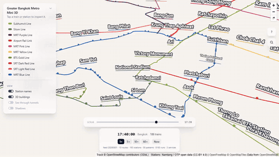
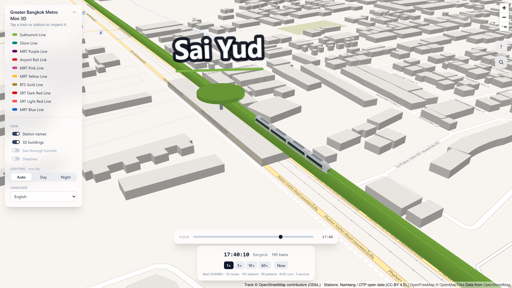
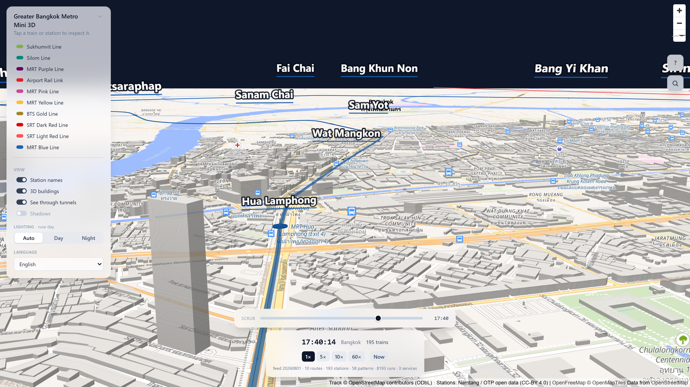
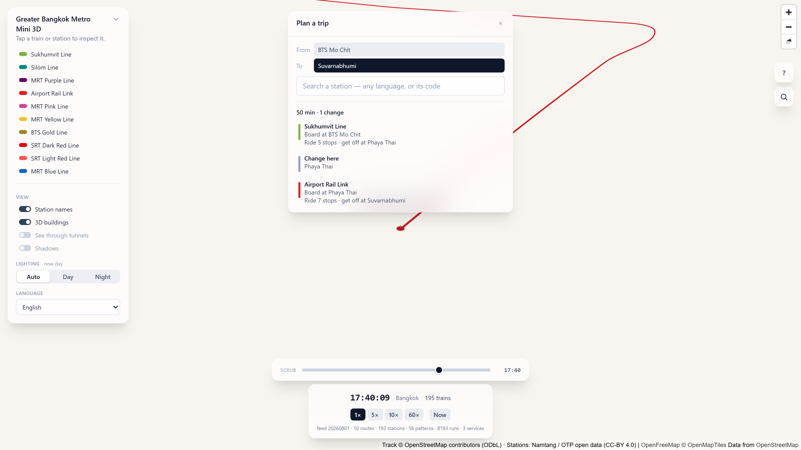
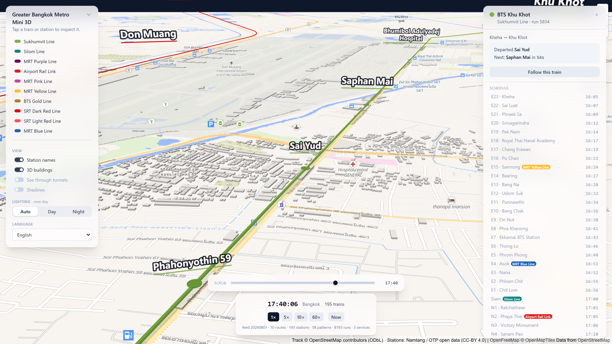
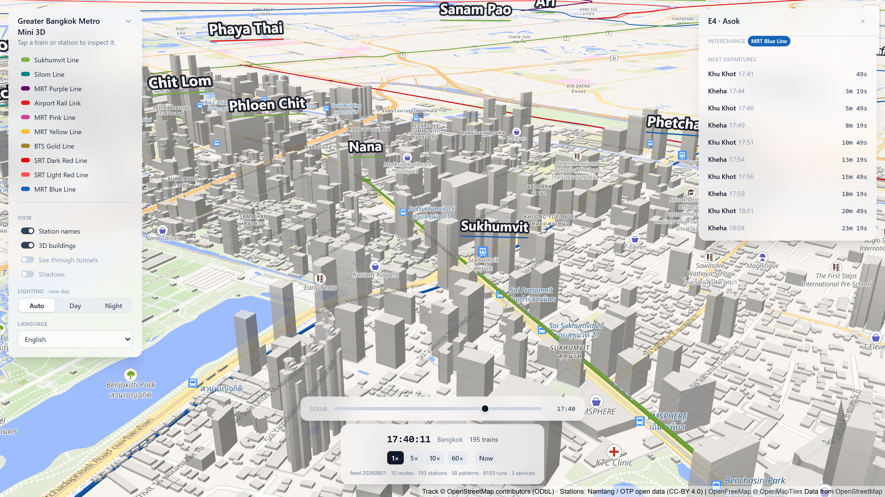
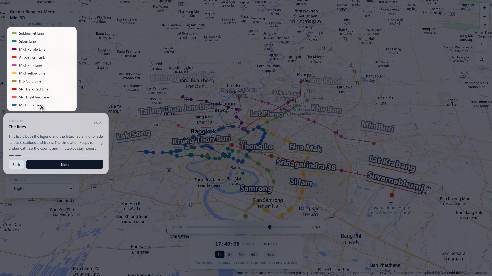
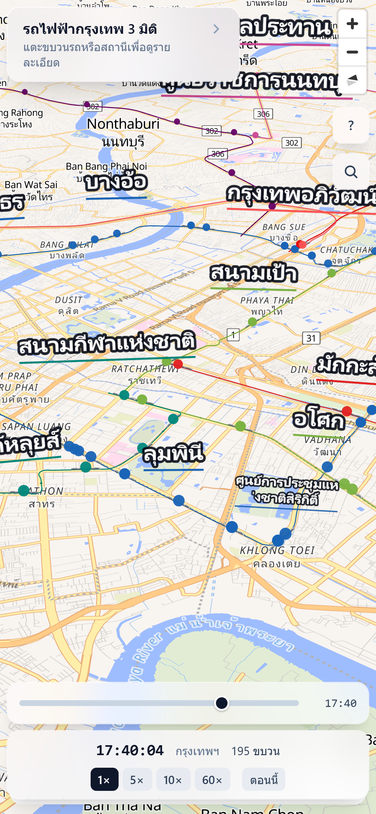
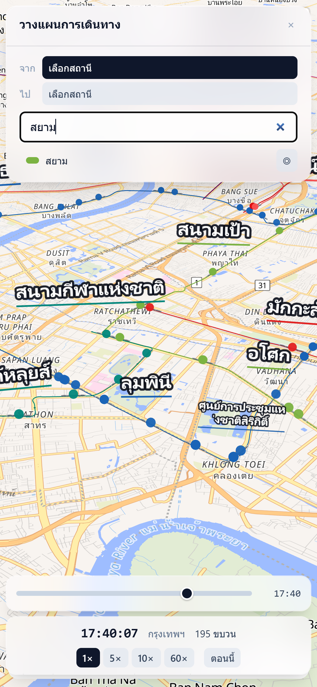

# Greater Bangkok Metro Mini 3D

> Interactive, web-based 3D visualization of Bangkok's rail transit network — trains moving on schedule along authentic geography, elevations, and timetables.

<p align="center">
  
</p>

<p align="center">
  <a href="https://metro.itstom.me"><b>Live demo</b></a> ·
  <a href="docs/media/demo.mp4"><b>Full 90s video</b></a> ·
  <a href="#gallery"><b>Gallery</b></a> ·
  <a href="#getting-started"><b>Getting started</b></a>
</p>

<p align="center">
  
  
  
  
  
  
  
</p>

---

**Status:** **MVP 1–6 delivered**, with one in-scope line outstanding for reasons
outside the project. BTS Green Line 3D track, a GTFS→binary data pipeline,
scheduled trains moving with time warp, click-to-inspect with a follow camera
and time scrubber, nine more lines, MRT Blue with real underground track,
see-through tunnels, clock-driven day/night, nine languages, a guided tour, and
station search with a journey planner — **10 lines simulated, 193 stations,
8,193 runs a day**.

**MRT Orange is not included and cannot be yet:** no OpenStreetMap route
relation exists to source its geometry from, and its alignment will not be
invented (see the [roadmap](#roadmap)). Two defects in the *published feed* are
repaired in the offline preprocessor and documented rather than hidden — see
[Two known problems in the published feed](#two-known-problems-in-the-published-feed).

See [CHANGELOG.md](./CHANGELOG.md) for what landed when.

---

## What it is

Greater Bangkok Metro Mini 3D renders the Bangkok Metropolitan Region's metro/rail lines as 3D track over a vector map and animates trains along them using published **static GTFS** timetables. Vehicle positions are computed by interpolating scheduled arrival/departure times — so you can watch the *scheduled* network at any moment, scrub through time, and follow individual trains.

> **Schedule-driven, not live.** v1.0 uses static timetables only, not real-time vehicle feeds (GTFS-Realtime). It shows where trains *should* be per schedule.

Full requirements live in [`docs/SRS.md`](./docs/SRS.md).

## Features

- 3D track geometry with real elevations — elevated (+12–22 m), at-grade, and underground (−12 to −25 m) segments.
- Schedule-based train motion with acceleration/deceleration easing and correct heading along the track.
- **Rolling stock you can actually read** — each fleet is modelled with a rounded body profile, a glazing band, a tapered cab nose and a waist stripe in its line's livery, so a train tells you which line it is on. Trains grow as you pull back so they stay visible, and past a few kilometres they become one coloured dot each, which turns the whole-region view into a live picture of where every train on the network is right now.
- Time controls — real-time clock, 1×/5×/10×/60× speed, and scrub to any time.
- Camera modes — free orbit and third-person train-follow.
- **Floating station names** — every station's name stands in 3D above its platform, always facing you, sized so it stays readable whether you are over one platform or looking at the whole region. Overlapping names are thinned out automatically, nearest first, with termini given priority.
- View modes — **see-through tunnels**, which draws below-ground track (MRT Blue's core) through the city above it, and a **shadow** toggle for track and trains.
- **A guided tour on first visit** — thirteen steps that dim the page, light up the one control being described and point an arrow at it, covering every feature in turn. It teaches by doing: the underground step flies to the Blue Line's tunnelled core and opens the tunnels, the "tap a train" step zooms onto a train that is actually running and opens its inspector, and the camera step orbits the city in front of you. Everything it changed is put back at the end. Skippable at any step, replayable from the About panel, and fully translated into all nine languages.
- **No cookies, no analytics, no accounts, no ads.** The only thing stored is your own view settings, on your own device — which is why there is no consent banner to click through. The About panel says so plainly and offers a "forget my settings" button.
- **Pick your language.** One setting drives the whole app — the interface, the line names and the station labels all switch together, and they show that language *only*, never a bilingual stack. The picker lists each language in its own script alongside how much of the network it actually names, because station names come from OpenStreetMap and its coverage is uneven (English 194/195 stations, Thai 151, Chinese 27, Japanese 18, then a handful each of Korean, French, Russian and German). Anything missing falls back to English, then Thai, so no station is ever left blank. The interface itself is translated into English, Thai, Chinese, Japanese, Korean, French, German, Russian and Spanish.
- **Find yourself.** A locate button puts your live GPS position on the map with a real, metre-accurate accuracy halo, updating as you move. It is strictly opt-in — nothing touches location until you press it.
- **3D buildings on or off.** They give the city depth, but they also hide elevated track from a low angle and are the heaviest thing the base map draws.
- **Lighting follows the clock.** In `auto` the sun is placed from a real solar-position calculation for the *simulated* time, so scrubbing to 06:00 gives a low eastern sun and 21:00 gives night — the base map dims with it while the network stays at full contrast. `day` / `night` pin it.
- **Search and a trip planner, for someone who has just arrived.** Type any station's name — in any language it has, or its code like `E4` — and get to it, or pick where you are and where you are going and be told which line to take, how many stops, and exactly where to change. Running times come from the published timetable, not from an assumed speed, and one fewer change is preferred over a few minutes saved. Search works regardless of the interface language: someone reading the Japanese UI who types "Asok" still finds アソーク駅.
- Line filters, a station/vehicle inspector, and a live timetable drawer.

## Gallery

Every image below is generated from the running app by `npm run media`, at a
pinned simulated time (Wednesday 17:40, the evening peak), so the gallery can be
regenerated after a visual change instead of slowly drifting out of date.

|  |  |
|---|---|
| [](docs/media/01-network-overview.png)<br>**The whole region.** Ten lines end to end, with floating station names decluttered nearest-first. | [](docs/media/02-trains-street-level.png)<br>**Street level.** Each fleet is modelled with a livery stripe, glazing band and tapered cab nose. |
| [](docs/media/03-underground-mrt-blue.png)<br>**See-through tunnels.** MRT Blue's tunnelled core drawn through the city above it, at its real depth. | [](docs/media/04-night-lighting.png)<br>**Night.** The sun is placed from a real solar calculation for the *simulated* clock; the base map dims with it. |
| [](docs/media/05-journey-planner.png)<br>**Journey planner.** Which line, how many stops, where to change — from the published timetable. | [](docs/media/06-train-inspector.png)<br>**Train inspector.** Headsign, next stop, ETA and the full call list for the selected run. |
| [](docs/media/07-station-board.png)<br>**Station board.** Live scheduled departures, with transfer chips at interchanges. | [](docs/media/08-guided-tour.png)<br>**Guided tour.** Dims the page, lights up the one control being described, and points at it. |
| [](docs/media/09-about-support.png)<br>**About.** Data provenance, the privacy position, and an entirely optional way to chip in. | <a href="docs/media/10-phone-map-thai.png"></a> <a href="docs/media/11-phone-search-thai.png"></a><br>**On a phone, in Thai.** The line panel collapses to its header; the planner becomes a bottom sheet. Verified down to 320 px. |

### Camera controls

**Mouse / trackpad**

| Gesture | Effect |
|---------|--------|
| Left-drag | Pan |
| Scroll wheel | Zoom |
| Press the wheel + drag, right-drag, or ctrl + left-drag | Orbit — drag up to tilt toward the horizon, down to flatten toward top-down, sideways to swing the compass bearing |

Orbiting moves both axes in one motion, so a diagonal drag tilts and turns together.

**Touch**

| Gesture | Effect |
|---------|--------|
| One-finger drag | Pan |
| Pinch | Zoom |
| Two-finger twist | Turn (bearing) |
| Two-finger vertical drag | Tilt (pitch) |

### Screen support

The app is one full-screen map with floating controls, and it is built for phones, tablets, laptops and large desktops from the same layout rather than a separate mobile build:

- **Phones (< 640 px).** The line list collapses to its header so the map keeps the screen, and the train/station detail panel becomes a bottom sheet instead of a card that would cover the whole viewport. Verified down to 320 px.
- **Landscape phones.** Treated as *short* rather than narrow (844 × 390 is wider than most tablets are tall): the line panel collapses on viewport height, and the feed-provenance line is dropped, so the bottom bar doesn't eat the view.
- **Tablets.** Full desktop layout, but every hit target is sized for a fingertip — that is keyed on `pointer: coarse`, not on screen width, because an iPad is desktop-wide and finger-driven at the same time.
- **Laptops and desktops.** Floating panels, denser rows, and a slightly wider detail card above 1280 px.
- Safe-area insets are honoured on notched phones, the map never fights the page for a gesture, and `prefers-reduced-motion` stops the panel transitions.

`npm run verify:responsive` asserts all of this against the real laid-out DOM across seven viewports (54 checks).

## Coverage

Operational lines receive full simulation (track + trains); pre-revenue lines are rendered as track only. **As of MVP 6 (2026-08-02), ten lines are simulated**: BTS Sukhumvit & Silom, MRT Blue, MRT Purple, Airport Rail Link, MRT Pink, MRT Yellow, BTS Gold, and SRT Dark/Light Red — 193 stations, 58 trip patterns, 8,193 expanded runs, ~273 KB gzip. MRT Orange is the one in-scope line still absent, and not for schedule reasons: it has no OSM route relation to source geometry from (see the note below).

| Line | Type | Operator | Structure | v1.0 |
|------|------|----------|-----------|------|
| BTS Sukhumvit & Silom (Green) | Heavy Rail | BTSC | Elevated | Full |
| MRT Purple | Heavy Rail | BEM | Elevated | Full |
| Airport Rail Link (ARL) | Express / Commuter | Asia Era One | Elevated | Full |
| MRT Pink | Monorail | NBM | Elevated | Full |
| MRT Yellow | Monorail | EBM | Elevated | Full |
| BTS Gold | APM (monorail-class) | BMA/KT (BTSC) | Elevated | Full |
| SRT Dark Red | Commuter Rail | SRTET | Elevated (nominal — see note) | Full |
| SRT Light Red | Commuter Rail | SRTET | Elevated (nominal — see note) | Full |
| MRT Blue | Heavy Rail | BEM | Underground / Elevated (real per-segment) | Full |
| MRT Orange | Heavy Rail | — | Underground / Elevated | **Not rendered — no OSM relation (see note)** |

> Line status re-verified 2026-07-31 (see [`docs/SRS.md` §2](./docs/SRS.md#2-system-scope--transit-coverage)): MRT Orange is still pre-revenue (Eastern Section now projected late 2027, Western Section 2030) and stays MVP 6 track-only. The Pink Line's Muang Thong Thani spur has been in full paid revenue service since 2025-06-17 but is **not yet in this registry** — the Namtang feed bundles its 4 shuttle trip patterns into the same GTFS route id as the main Pink Line, and its own OSM relation pair wasn't fetched for this task, so it's excluded from simulation for now (main Pink Line is unaffected). The Purple Line's Tao Poon–Rat Burana southern extension remains under construction, not open.
>
> **MRT Orange (updated 2026-08-02):** the blocker is no longer just the missing timetable — it is missing *geometry*. Every line's track comes from a pinned OpenStreetMap route relation, and Orange has none. A live Overpass sweep of the Bangkok bbox on 2026-08-02 across `route=subway|train|light_rail|monorail`, `route=construction`, and `construction:route`/`proposed:route` returned zero Orange candidates; the only name match in the region is an unrelated `route=ferry` "Orange flag boat" (relation 2403874). Rather than invent an alignment, the line is left out until an upstream relation exists or a different geometry source is chosen.
>
> **Structure is now per-segment, from OSM's own tags (MVP 6).** Each member way's `tunnel`/`bridge` tags decide its altitude, so a line is no longer forced to one nominal height: MRT Blue renders viaduct–tunnel–viaduct (231 elevated / 264 underground track points), and the short tunnel sections OSM records on the Airport Rail Link and SRT Red are picked up too. Every structure change is ramped over ~220 m, so a portal is a gradient rather than a 33 m step. A line's registry `structure` is now only the fallback for untagged ways — which is why the uniformly-elevated lines render exactly as they did before.

### Track geometry provenance (OSM relations)

Every line's 3D track polyline comes from a **pinned** OpenStreetMap route relation (never a live discovery lookup at build time — a name-match discovery mode exists in `tools/fetch-network.mjs` only for bootstrapping a *new* line, and its resolved id must be pinned back into the registry before it's committed). Station coordinates for simulated lines come from the Namtang GTFS feed; track-only lines (currently none — see [Coverage](#coverage)) would use OSM stop nodes instead.

| Line | OSM relation id | GTFS `route_id` |
|------|-----------------|------------------|
| BTS Sukhumvit | [444651](https://www.openstreetmap.org/relation/444651) | `1` |
| BTS Silom | [2067854](https://www.openstreetmap.org/relation/2067854) | `2` |
| MRT Purple | [6988563](https://www.openstreetmap.org/relation/6988563) | `4` |
| Airport Rail Link | [2148241](https://www.openstreetmap.org/relation/2148241) | `5` |
| MRT Pink | [16740886](https://www.openstreetmap.org/relation/16740886) | `2436` |
| MRT Yellow | [15806897](https://www.openstreetmap.org/relation/15806897) | `2224` |
| BTS Gold | [11681439](https://www.openstreetmap.org/relation/11681439) | `2025` |
| SRT Dark Red | [13058384](https://www.openstreetmap.org/relation/13058384) | `2026` |
| SRT Light Red | [13178788](https://www.openstreetmap.org/relation/13178788) | `2027` |
| MRT Blue | [444659](https://www.openstreetmap.org/relation/444659) | `3` |

> Relation 444659 is named "(Tha Phra → Lak Song)" but covers the **whole** Blue Line, not the 4-station western extension its name suggests: the line's service pattern is a loop, so this direction runs Tha Phra → the full circle via Bang Sue and Hua Lamphong → Tha Phra → Lak Song. Verified live (2026-08-02): 11 ways / 505 points / 39 stop nodes spanning lat 13.711–13.814, lon 100.410–100.575.

Source of truth for this table: `tools/lines.config.mjs`'s `LINES` registry — update there first, this table is descriptive.

## Tech stack

| Layer | Technology |
|-------|-----------|
| UI | React 19, Tailwind CSS, Lucide, Zustand |
| Build | Vite + TypeScript |
| Base map | MapLibre GL JS (vector tiles, 3D terrain) |
| 3D | Three.js via a custom MapLibre WebGL layer |
| Simulation core | Rust → WebAssembly (`wasm-pack`), run in a Web Worker |
| Data pipeline | Rust CLI: GTFS ZIP → compact binary cache (+ OpenStreetMap geometry) |

See [§3A of the SRS](./docs/SRS.md) for design rationale and key risks (cross-origin isolation, the MapLibre↔Three bridge, float precision at city scale, serialization).

## Project structure

```
tha-metro-mini-3d/
├── rust-engine/          # Rust Wasm simulation core (parser, interpolation, spatial)
├── src/                  # Vite + React frontend
│   ├── components/       # UI overlay, controls, inspector, time scrubber
│   ├── map/              # MapLibre ↔ Three.js bridge, vehicle & camera managers
│   ├── stores/           # Zustand state
│   └── types/
├── tools/                # data-fetch, verification & screenshot scripts
├── index.html
└── vite.config.ts
```

## Getting started

> Prerequisites: [Node.js](https://nodejs.org/) 18+. The built Wasm engine (`src/sim/pkg/`) and binary timetable (`public/data/network.tmb`) are committed, so a Rust toolchain is **only** needed to regenerate them ([Rust](https://rustup.rs/) + `wasm32-unknown-unknown` target + [`wasm-pack`](https://rustwasm.github.io/wasm-pack/); see `rust-engine/`).

```bash
# clone
git clone https://github.com/naiiytom/tha-metro-mini-3d.git
cd tha-metro-mini-3d

# install deps and run the dev server
npm install
npm run dev
```

Other scripts:

| Command | What it does |
|---------|--------------|
| `npm run build` | Type-check (`tsc -b`) + production build to `dist/` |
| `npm run typecheck` | Type-check only |
| `npm test` | Vitest unit tests for the pure helpers (time formatting, bearing math) |
| `npm run preview` | Serve the production build locally |
| `npm run data:fetch [lineKey ...]` | Regenerate `src/data/network.json` — every registry line's track geometry + stations from OpenStreetMap (Overpass); pass one or more `tools/lines.config.mjs` keys to fetch a subset |
| `node tools/inspect-gtfs.mjs <gtfs-dir>` | Read-only: print every route in an extracted GTFS feed (id, agency, names, colour, trip count, frequency-based or not) — the fastest way to check a feed before adding a `tools/lines.config.mjs` entry |
| `npm run screenshot -- [url] [outDir]` | Headless-browser screenshots from several camera poses (visual check) |
| `npm run verify:camera` | Camera gesture assertions (pan/zoom/pitch/bearing) against a running dev server |
| `npm run verify:mvp4` | MVP 4 acceptance: selection, follow-camera, inspector, station board, scrubbing |
| `npm run verify:mvp5` | MVP 5 acceptance: every registry line renders in order, trains run on 3+ lines at once, hiding a line preserves its simulation and blocks its clicks, interchange chips render, monorail vs. heavy-rail rendered geometry differs |
| `npm run verify:kinematics` | Data-level motion assertions against a running dev server |
| `npm run verify:closeup` | Camera-on-a-train screenshot against a running dev server |
| `npm run build && npm run preview` (one shell), then `npm run verify:perf` (another) | NF1 performance acceptance against a **production** build: tick-count sanity, sim tick time, truncation, frame rate, and peak-concurrency scale — see [Coverage](#coverage) for the current, honestly-disclosed 4/5 result |

Rust toolchain required for these (see [CONTRIBUTING](./docs/CONTRIBUTING.md)):

| Command | What it does |
|---------|--------------|
| `npm run rust:test` | `cargo test` across the `rust-engine/` workspace (36 tests) |
| `npm run wasm:build` | Rebuild the Wasm engine into `src/sim/pkg/` (committed output) |
| `npm run data:preprocess -- --gtfs <gtfs-dir>` | Regenerate `public/data/network.tmb` for the whole registry from an extracted GTFS feed (committed output) — route identity comes entirely from `network.json`'s line order |

## Roadmap

Delivered as vertical, shippable slices — track geometry first, then motion, then breadth.

| MVP | Deliverable |
|-----|-------------|
| **1** ✅ | **BTS Green Line track laid** — 3D geometry over the map, no trains. Proves the full render pipeline. **Delivered:** MapLibre (OpenFreeMap vector tiles) + Three.js custom layer with floating-origin coordinates; spline-smoothed elevated track for both branches; station markers; free orbit camera. |
| **2** ✅ | Green Line data pipeline — GTFS → binary cache, loaded & validated client-side. **Delivered:** Rust preprocessor expands the frequency-based Namtang feed (14 patterns → 2,162 runs, 61 stations snapped onto track) into a 123 KB bincode cache (71 KB gzip vs 3 MB budget); client validation summary shown in the UI. |
| **3** ✅ | Green Line trains moving — Wasm interpolation engine + Web Worker. **Delivered:** 93 KB Wasm engine (dwell/transit/smoothstep/tangent-yaw) evaluated at 10 Hz in a worker, transferable-buffer ping-pong, render-side interpolation, InstancedMesh 4-car trains (2 draw calls), 1×/5×/10×/60× time-warp with Bangkok clock. |
| **4** ✅ | Interaction & UI — follow-cam, inspector, time scrubber, timetable drawer. **Delivered:** click-to-select trains and stations (screen-space picking), third-person follow camera, train inspector with next-stop ETA and the full call list, live station board, and a scrubber over the service day; schedule lookups added to the Rust engine and crossed over a promise-based worker query channel. |
| **5** ✅ | Multi-line breadth — Purple, ARL, Pink, Yellow, Gold, Red. **Delivered:** the line registry (`tools/lines.config.mjs`) grew from 2 to 9 entries with pinned OSM relation ids and GTFS route ids verified against the real Namtang feed; 155 stations, 34 patterns, 4,481 runs, ~213 KB gzip cache. Surfaced and fixed real data-pipeline gaps along the way: an OSM-node-id type mismatch, the Pink Line's Muang Thong Thani spur trips sharing a GTFS route id with the main line, a GTFS/OSM coordinate mismatch at the Pink Line's own terminus, and OSM stop-position nodes without name tags silently blanking station names. Line selector, cross-route interchange metadata, and monorail/APM vehicle models shipped alongside; `npm run verify:mvp5` (6/6) and `npm run verify:mvp4` (14/14, unchanged) both green. **NF1 performance is 4 of 5 sub-checks, disclosed not hidden:** the sim ticks a meaningful sample count, sim tick (p95 ≈ 0.2–0.3 ms), no truncation, and frame rate (~100 FPS) all pass; the ≥300-concurrent-vehicle scale target is not yet reached — this real 9-line network's measured peak is 171–172 vehicles, well under `MAX_VEHICLES` (1024) but under the 300 target too. That's real GTFS schedule density for these lines, not a bug, and the assertion is left failing on purpose rather than weakened. |
| **6** 🟡 | Underground + polish — MRT Blue, transparency mode, day/night lighting. **Delivered:** MRT Blue simulated (OSM relation 444659, GTFS `route_id` 3) taking the network to 10 lines / 193 stations / 58 patterns / 8,193 runs; track structure derived per OSM way from `tunnel`/`bridge` tags with ~220 m ramps at every portal, so Blue is genuinely viaduct–tunnel–viaduct rather than one nominal altitude; see-through tunnels (F3.2) and day/night lighting (F3.3), the latter repainting MapLibre's own style so the track stays at full contrast while the city dims. Floating 3D station-name labels with screen-space decluttering; clock-driven sun position (F3.3) with `auto`/`day`/`night`; a shadow-quality toggle (§3A.5); and the glassmorphism UI pass. `npm run verify:mvp6` (22/22) green, and `verify:mvp4` (14/14) / `verify:mvp5` (6/6) / `verify:camera` (10/10) / `verify:kinematics` all still pass. Peak concurrency rose from 171–172 to **246** vehicles — closer to NF1's 300 target but still short, and Blue was the last line the feed had to give; sim tick p95 1.20 ms and 130 FPS against a production build. Bundle split so the app chunk is 353 KB instead of 1.8 MB (Three and MapLibre cache separately). Shipped alongside: a full **responsive/touch pass** — see [Screen support](#screen-support) — with `verify:responsive` (54/54), and a **language / GPS / 3D-buildings** pass with `verify:ux` (13/13). **Not delivered:** MRT Orange (no OSM relation, see Coverage) — the only outstanding MVP 6 item. |

## Data & licensing

- Transit schedules & station coordinates: static **GTFS** ([Namtang / OTP open-data programme](https://namtang-api.otp.go.th/opendata), CC-BY 4.0).
- Track geometry: **OpenStreetMap** — © OpenStreetMap contributors, [ODbL](https://opendatacommons.org/licenses/odbl/); attribution required (rendered in the map attribution control).
- Base map: [OpenFreeMap](https://openfreemap.org/) vector tiles (Liberty style).
- Any scraped source is a fallback only, used in the offline preprocessor, subject to the source's terms.

### Two known problems in the published feed

Both are visible in `public/data/network.report.json`, and both are handled in the offline preprocessor rather than papered over at render time.

- **Six MRT Blue trips publish zero travel time between stations** (5285, 7869, 7870, 7874–7876): every stop reads `arrival = 60i, departure = 60(i+1)`, putting 26 stations and 47 km inside 25 minutes. Left alone, a train stands still and then jumps a kilometre and a half the instant the dwell ends. The dwell is capped at 20 s so the leg has time to be travelled; the **arrival times are left exactly as published**, because those are what a rider reads off a board. 145 stops adjusted, reported as `zero_travel_legs_repaired`. This does not make those trips physically possible — nothing can — it stops the trains teleporting.
- **The two ARL express trips schedule Suvarnabhumi → Lat Krabang in 60 seconds** — 5.09 km, so 306 km/h. That is the feed's own arrival times, and inventing a different schedule would be worse than showing a fast train, so it stands. Every leg above 200 km/h is listed as `implausible_legs` so the next one of these is noticed rather than discovered.

## Supporting the project

It is free, open source, has no ads and no tracking, and it will stay that way.
If it is useful to you and you feel like chipping in, there is a PromptPay code
in the app's **About** panel — entirely optional, and nothing in the interface
will ask you twice.


**PromptPay** · `095-846-2520`<br>
**TrueMoney Wallet** · `095-846-2520`<br>
**SCB** · `766-251958-6`

Check the number your banking app shows against the digits above before you
confirm. The QR is generated at build time by `npm run promptpay:qr` from
[`src/lib/promptpay.ts`](./src/lib/promptpay.ts) and committed, precisely so it
is a reviewable file rather than something a page assembles at runtime — decode
it yourself if you like. It is a *static* payload: no amount is baked in, so you
choose what to send.

The SCB account is offered as text for anyone who would rather type it, and is
deliberately **not** encoded into the QR: PromptPay resolves a registered
identifier — a mobile number, a national ID or an e-wallet id — to an account
rather than being addressed by the account number, and support for the EMVCo
bank-account tag is inconsistent across Thai banking apps. One identifier that
works for every payer beats a code that silently fails for some.

<br clear="left">

## Contributing

Contributions are welcome. Start with [CONTRIBUTING.md](./docs/CONTRIBUTING.md) — it covers setup, how work is scoped into MVP slices, and the architectural conventions that get checked in review. By participating you agree to the [Code of Conduct](./docs/CODE_OF_CONDUCT.md).

## License

Source code is licensed under the [MIT License](./LICENSE).

Bundled data keeps its own terms: OpenStreetMap-derived track geometry is ODbL, and the Namtang GTFS-derived timetables and station coordinates are CC-BY 4.0. Both attributions render in the map's attribution control and must be kept in any redistribution.

---

*This is a fan/hobby visualization project and is not affiliated with any transit operator.*
